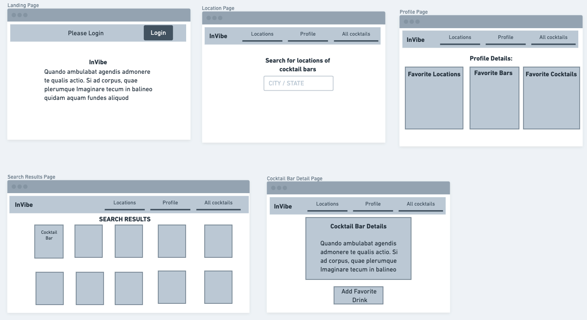
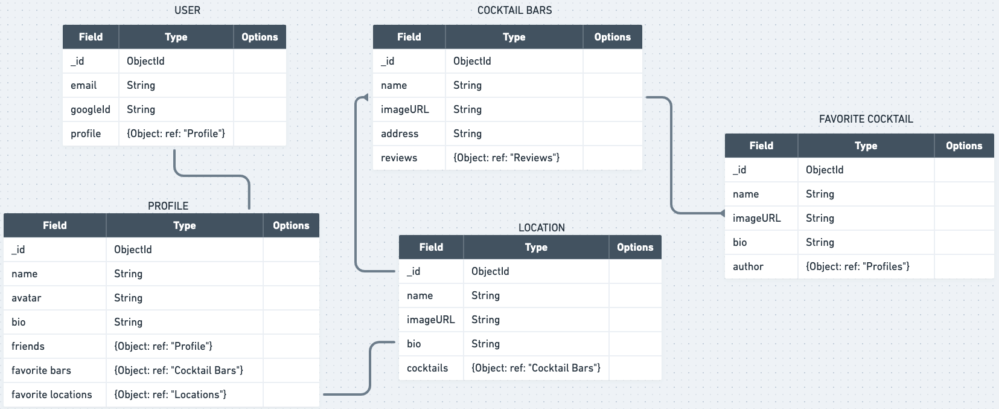

# **InVibe** 
## Check out _[InVibe](deployment)_ here!

---

&nbsp;

## Creators:

- Jeff Gore  [LinkedIn](https://www.linkedin.com/in/jeffgore77/) 
  
- Darby Benfield [LinkedIn](https://www.linkedin.com/in/darby-benfield/)  
  
- Merkis Ruiz [LinkedIn](https://www.linkedin.com/in/merkis-ruiz/)  
  

&nbsp;

## About InVIbe:

Ever find yourself in a new city wanting to sip on a decent cocktail only to be met with choice overload? 

InVibe serves as the perfect hub for finding the highest rated bars in your city using Yelps comprehensive API! 

&nbsp;

## Objective:

To build a full CRUD, full MERN stack application that is fun and easy to use!

&nbsp;

## Getting Started:

[Trello](https://trello.com/b/2US7FRw2/the-tipsy-triumvirate) was an invaluable resource for group planning and organization. 

&nbsp;

## Motivation:

Our team is built of travels and people that love to enjoy a stunning location with a delicious drink in hand. We wanted to make this more accessible to fellow cocktail connoisseurs. 

&nbsp;

## Wireframe & ERD:

&nbsp;

&nbsp;

## InVibe's Site:

&nbsp;

&nbsp;

## Minimum Viable Product:

1. A site that can be logged into using JWT-token-based authentication. 
   
2. Access to content and features once the user is logged in
   
3. The ability to search the Yelp API for travel locations
   
4. The ability to add, update, and delete cocktails on specific locations.
    
   
5. The ability to view other profiles and to follow or unfollow these profiles. 
   

   

&nbsp;

&nbsp;

## Future Goals:

  1. Unfollow profiles that have been followed. 
  2. Improved alternate text/accesibility.
  3. Save specific locations to profile. 
  4. Save specific bars to profile. 
  5. Cocktails that have been added will show as a list on the profile as well as the location that they were added to. 

&nbsp;

## Hindsight Perspective:

Moving forward, it would benefit our team to ... 

&nbsp;

## Credits/ Invaluable Resources:
1. Ben Manley- we are grateful for the support and guidance with InVibe. 
2. [Unsplash](https://www.unsplash.com/) for beautiful images
3. 

&nbsp;

## Technology Used:

- Axios
- React JSX

